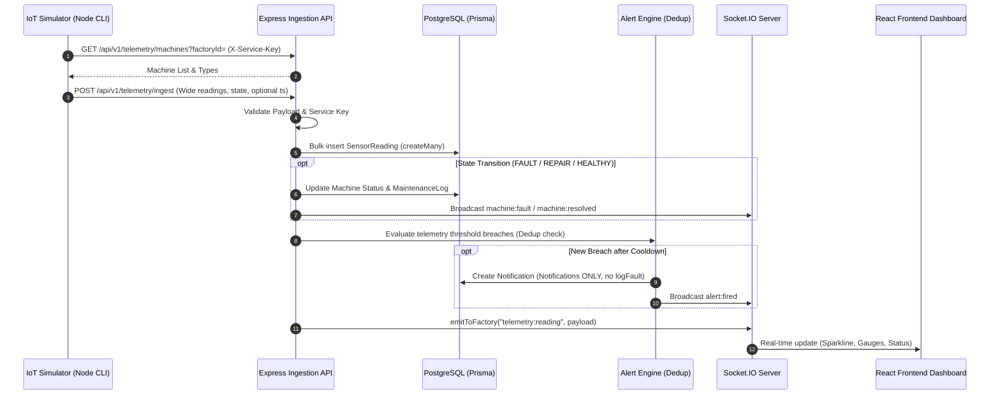

# Implementation Plan: Simulated IoT Telemetry & Real-Time Pipeline (Amended)

This document provides a comprehensive step-by-step implementation plan for adding a software-simulated IoT telemetry node and real-time processing pipeline to the **Smart Factory** platform.

The simulator mimics an Arduino-style sensor node's serial/JSON output feeding the exact same backend ingestion and real-time Socket.IO pipeline that a real physical hardware device would use.

---

## 1. Files & Modules Inspected

- **Database & Prisma**: [`backend/prisma/schema.prisma`](file:///c:/Programs/SmartFactory/backend/prisma/schema.prisma)
- **Backend Application & Server**: [`backend/src/app.js`](file:///c:/Programs/SmartFactory/backend/src/app.js), [`backend/server.js`](file:///c:/Programs/SmartFactory/backend/server.js), [`backend/src/config/env.js`](file:///c:/Programs/SmartFactory/backend/src/config/env.js), [`backend/src/config/socket.js`](file:///c:/Programs/SmartFactory/backend/src/config/socket.js)
- **Middleware & Security**: [`backend/src/middleware/auth.middleware.js`](file:///c:/Programs/SmartFactory/backend/src/middleware/auth.middleware.js), [`backend/src/middleware/rbac.middleware.js`](file:///c:/Programs/SmartFactory/backend/src/middleware/rbac.middleware.js), [`backend/src/middleware/validate.js`](file:///c:/Programs/SmartFactory/backend/src/middleware/validate.js)
- **Alerts & Notifications**: [`backend/src/modules/alerts/alert.engine.js`](file:///c:/Programs/SmartFactory/backend/src/modules/alerts/alert.engine.js), [`backend/src/modules/notifications/notification.service.js`](file:///c:/Programs/SmartFactory/backend/src/modules/notifications/notification.service.js), [`backend/src/modules/notifications/notification.schema.js`](file:///c:/Programs/SmartFactory/backend/src/modules/notifications/notification.schema.js), [`backend/src/modules/notifications/notification.routes.js`](file:///c:/Programs/SmartFactory/backend/src/modules/notifications/notification.routes.js)
- **Machines Module**: [`backend/src/modules/machines/machine.service.js`](file:///c:/Programs/SmartFactory/backend/src/modules/machines/machine.service.js), [`backend/src/modules/machines/machine.controller.js`](file:///c:/Programs/SmartFactory/backend/src/modules/machines/machine.controller.js)
- **Frontend Core & State**: [`frontend/src/lib/api.ts`](file:///c:/Programs/SmartFactory/frontend/src/lib/api.ts), [`frontend/src/lib/socket.ts`](file:///c:/Programs/SmartFactory/frontend/src/lib/socket.ts), [`frontend/src/pages/Machines.tsx`](file:///c:/Programs/SmartFactory/frontend/src/pages/Machines.tsx), [`frontend/src/pages/Settings.tsx`](file:///c:/Programs/SmartFactory/frontend/src/pages/Settings.tsx)

---

## 2. Approved Amendments & Database Schema Changes

Modify [`backend/prisma/schema.prisma`](file:///c:/Programs/SmartFactory/backend/prisma/schema.prisma):

```prisma
// Extend AlertConfig with telemetry thresholds & alert cooldown
model AlertConfig {
  id                     String  @id @default(uuid())
  factoryId              String  @unique
  productionThresholdPct Int     @default(80)
  rejectionThresholdPct  Int     @default(5)
  machineIdleMinutes     Int     @default(30)
  tempMaxThreshold       Float   @default(85.0)   // °C
  vibMaxThreshold        Float   @default(5.0)    // mm/s
  rpmMinThreshold        Float   @default(800.0)  // RPM
  rpmMaxThreshold        Float   @default(3000.0) // RPM
  alertCooldownMinutes   Int     @default(10)     // Cooldown period for alert dedup

  factory Factory @relation(fields: [factoryId], references: [id], onDelete: Cascade)
}

// Wide SensorReading model (1 row per machine per reading)
model SensorReading {
  id          String   @id @default(uuid())
  machineId   String
  factoryId   String
  temperature Float
  vibration   Float
  rpm         Float
  timestamp   DateTime @default(now())

  machine Machine @relation(fields: [machineId], references: [id], onDelete: Cascade)
  factory Factory @relation(fields: [factoryId], references: [id], onDelete: Cascade)

  @@index([machineId, timestamp])
  @@index([factoryId, timestamp])
}

// Long-term rollup table for downsampled retention (1-minute buckets)
model SensorReadingRollup {
  id        String   @id @default(uuid())
  machineId String
  factoryId String
  bucket    DateTime // 1-minute floor timestamp
  tempAvg   Float
  tempMin   Float
  tempMax   Float
  vibAvg    Float
  vibMin    Float
  vibMax    Float
  rpmAvg    Float
  rpmMin    Float
  rpmMax    Float

  machine Machine @relation(fields: [machineId], references: [id], onDelete: Cascade)
  factory Factory @relation(fields: [factoryId], references: [id], onDelete: Cascade)

  @@unique([machineId, bucket])
  @@index([factoryId, bucket])
}
```

Add inverse relation fields:
- `Machine`: `sensorReadings SensorReading[]`, `sensorRollups SensorReadingRollup[]`
- `Factory`: `sensorReadings SensorReading[]`, `sensorRollups SensorReadingRollup[]`

---

## 3. Ordered Implementation Steps

### Step 1: Database Migration & Environment Setup
- **Files to Modify**:
  - `backend/prisma/schema.prisma`
  - `backend/src/config/env.js` (Add `SIMULATOR_API_KEY`)
  - `backend/.env` (Add `SIMULATOR_API_KEY=smart_factory_sim_secret_key_2026`)
- **Commands**:
  - Run `npx prisma migrate dev --name add_telemetry_wide_reading_and_rollup`

### Step 2: Backend Ingestion & Service Telemetry Module
- **Files to Create**:
  - `backend/src/middleware/serviceAuth.middleware.js`: Verifies `X-Service-Key` header matching `SIMULATOR_API_KEY`.
  - `backend/src/modules/telemetry/telemetry.schema.js`: Zod schema for reading payloads (single reading or array with optional timestamps).
  - `backend/src/modules/telemetry/telemetry.service.js`:
    - `getMachinesForSimulator(factoryId)`: Service endpoint for simulator to fetch machine IDs & types.
    - `ingestReadings(payload, serviceFactoryId)`: Handles wide rows bulk insertion (`prisma.sensorReading.createMany`), processes state transitions (`FAULT` -> creates fault log; `REPAIR` -> updates status to MAINTENANCE; `HEALTHY` -> resolves fault log), emits `telemetry:reading` socket events, and evaluates alerts.
    - `getMachineTelemetry(machineId, factoryId)`: Enforces JWT, RBAC (`resolveFactoryContext`), and factory scoping.
  - `backend/src/modules/telemetry/telemetry.controller.js`: Handlers for simulator endpoints and user telemetry API.
  - `backend/src/modules/telemetry/telemetry.routes.js`: Maps routes:
    - `GET /api/v1/telemetry/machines?factoryId=` (Service key auth)
    - `POST /api/v1/telemetry/ingest` (Service key auth)
    - `GET /api/v1/telemetry/machine/:machineId` (JWT + RBAC + Factory scoped)
- **Files to Modify**:
  - `backend/src/app.js`: Register `/api/v1/telemetry`.

### Step 3: Alert Engine Dedup & Notification Rules
- **Files to Modify**:
  - `backend/src/modules/alerts/alert.engine.js`:
    - Threshold breaches create **notifications only** (never calls `logFault`).
    - Alert deduplication: 1 alert per machine + metric until value returns to normal or `alertCooldownMinutes` (default 10 min) expires.
  - `backend/src/modules/notifications/notification.schema.js` & `notification.service.js`: Support threshold settings & cooldown period configuration.

### Step 4: Data Retention & 1-Minute Rollup Job
- **Files to Create**:
  - `backend/src/services/telemetryCleanup.service.js`: Before deleting raw `SensorReading` rows older than 7 days, aggregates them into `SensorReadingRollup` (1-minute avg/min/max per metric per machine) and deletes the raw rows.
- **Files to Modify**:
  - `backend/server.js`: Initialize scheduled retention job.

### Step 5: Standalone IoT Telemetry Simulator Script
- **Files to Create**:
  - `backend/src/simulator/simulator.js`:
    - Default interval 10s.
    - CLI flags: `--factory <id>`, `--interval <sec>`, `--force-fault <machineId>`, `--backfill-days <N>`.
    - Automatically queries `GET /api/v1/telemetry/machines?factoryId=` for machine IDs & types using `X-Service-Key`.
    - Handles `--backfill-days N` by generating backdated historical readings in batch payloads with custom timestamps.
    - State Machine per machine: `HEALTHY` -> `DEGRADING` -> `FAULT` -> `REPAIR` (random 5-30 min) -> `HEALTHY`.
    - Updates backend machine status on each state transition.
- **Files to Modify**:
  - `backend/package.json`: Add `"simulator": "node src/simulator/simulator.js"`.

### Step 6: Frontend Real-time Visualization & Signal Monitoring
- **Files to Create/Modify**:
  - `frontend/src/lib/api.ts`: Add `telemetryApi.getMachineTelemetry`.
  - `frontend/src/hooks/useTelemetryData.ts`: React Query hook + Socket.IO real-time event listener + 30s stale signal detection.
  - `frontend/src/components/telemetry/TelemetryMetrics.tsx`: Gauges & Recharts sparklines for Temperature, Vibration, and RPM.
  - `frontend/src/pages/Machines.tsx`: Embed telemetry metrics component into machine cards + display `"Stale / No Signal"` badge if no reading arrives for 30s.
  - `frontend/src/pages/Settings.tsx`: Add controls to edit metric thresholds and alert cooldown duration.

---

## 4. Architecture Data Flow



---

## 5. Manual Verification & Test Plan

| Step | Action | Expected Result |
| :--- | :--- | :--- |
| **1. Database Schema** | Run `npx prisma migrate dev` | `SensorReading` (wide) & `SensorReadingRollup` tables created. |
| **2. Simulator Discovery** | Simulator fetches `/telemetry/machines` | Returns active machines matching target factory. |
| **3. Historical Backfill** | Run `npm run simulator -- --factory <id> --backfill-days 1` | Backfills 1 day of historical wide readings with custom timestamps. |
| **4. Live Telemetry & Dedup** | Run simulator at 10s interval & trigger high temp | Metric updates live on dashboard. Alert notification created once; consecutive readings during cooldown do not duplicate notification. |
| **5. Simulator State Loop** | Simulator transitions `HEALTHY` -> `DEGRADING` -> `FAULT` -> `REPAIR` -> `HEALTHY` | Fault log created when entering `FAULT`, machine status changes to `MAINTENANCE` during `REPAIR`, and resolved when returning to `HEALTHY`. |
| **6. Stale Signal Indicator** | Stop simulator for 30s | Frontend machine cards display `"Stale / No Signal"`. |
| **7. Retention Rollup** | Trigger rollup retention job | Raw rows older than 7 days are aggregated into 1-minute `SensorReadingRollup` buckets and raw rows deleted. |
